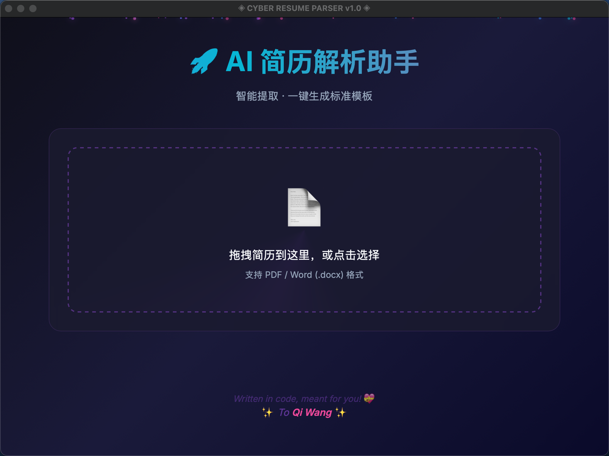

# ◈ CYBER RESUME PARSER v1.0 ◈

一键将简历（PDF/Word）转换为标准化 Excel 模板，基于 AI 智能提取信息。


## ✨ 功能特点

- 🔍 **智能解析**：支持 PDF 和 Word (.docx) 格式简历
- 🤖 **AI 提取**：使用 DeepSeek 大模型智能提取结构化信息
- 📊 **Excel 输出**：自动填充标准化 Excel 模板
- 🎯 **缺失提醒**：未识别字段黄色高亮 + 红色【待补充】标记
- 🎓 **学历支持**：本科/硕士/博士多学历自动识别
- 🖥️ **桌面应用**：赛博朋克风格独立桌面窗口
- 📦 **批量处理**：支持多文件上传和批量下载

## 📸 界面预览



## 🚀 快速开始

### 方式一：直接运行打包版（推荐）

双击 `dist/Cyber Resume Parser.app` 即可运行，无需安装任何依赖！

### 方式二：从源码运行

#### 1. 安装依赖

```bash
# 克隆项目
git clone https://github.com/Polly2014/Hr_Resume_Translator.git
cd Hr_Resume_Translator

# 创建虚拟环境
python -m venv venv
source venv/bin/activate  # Windows: venv\Scripts\activate

# 安装依赖
pip install -r requirements.txt
```

#### 2. 配置 API

创建 `.env` 文件：

```env
DEEPSEEK_API_KEY=your_api_key_here
DEEPSEEK_BASE_URL=https://api.deepseek.com
AI_MODEL=deepseek-chat
AI_TIMEOUT=150
```

#### 3. 运行应用

```bash
# 桌面窗口模式（推荐）
python desktop_app.py --mode desktop

# 浏览器模式（开发调试）
python desktop_app.py --mode browser
```

## 📁 项目结构

```
Hr_Resume_Translator/
├── desktop_app.py              # 桌面应用主程序 (Flask + PyWebView)
├── resume_parser.py            # 简历解析核心模块
├── resume_template_generator.py # Excel 模板生成器
├── process_resume.py           # 命令行工具
├── build_app.spec              # PyInstaller 打包配置
├── requirements.txt            # 依赖列表
├── .env                        # API 配置 (需自行创建)
├── static/
│   └── index.html              # 赛博朋克风格前端界面
├── Templates/
│   └── template.xlsx           # Excel 模板
├── Resumes/                    # 简历文件目录
└── dist/
    └── Cyber Resume Parser.app # 打包后的 macOS 应用
```

## 🔧 命令行使用

```bash
# 解析单个简历
python process_resume.py Resumes/example.pdf

# 批量解析目录
python process_resume.py Resumes/example.pdf -o output/
```

## 📦 打包独立应用

```bash
# 安装打包工具
pip install pyinstaller

# 打包 macOS 应用
pyinstaller build_app.spec --clean --noconfirm
```

打包后的应用位于 `dist/Cyber Resume Parser.app`

## 📋 提取的信息

| 类别 | 字段 |
|------|------|
| 基本信息 | 姓名、供应商 |
| 个人信息 | 身份证号、出生日期、电话、首次工作时间、首次IT工作时间、最高学历 |
| 学历信息 | 学校、专业、学历、入学/毕业时间、毕业证/学位证编号（支持多段学历） |
| 工作经历 | 公司、职位、时间、是否邮储自主研发经验（支持多段经历） |
| 项目经历 | 项目名称、职责、时间、项目描述（支持多段经历） |
| 技术特长 | 编程语言、技能列表、专业证书 |

## 🛠️ 技术栈

- **PDF 解析**: PyMuPDF (fitz)
- **Word 解析**: python-docx
- **AI 模型**: DeepSeek (via OpenAI API)
- **Excel 处理**: openpyxl
- **Web 框架**: Flask + Flask-CORS
- **桌面窗口**: PyWebView
- **前端**: 原生 HTML/CSS/JS (赛博朋克风格)
- **打包工具**: PyInstaller

## 📄 License

MIT License

## 🤝 贡献

欢迎提交 Issue 和 Pull Request！

---

<div align="center">

*Written in code, meant for you!* 💝

Made with ❤️ for Qi Wang

</div>
